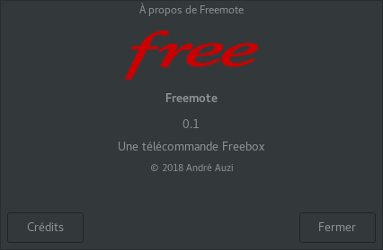
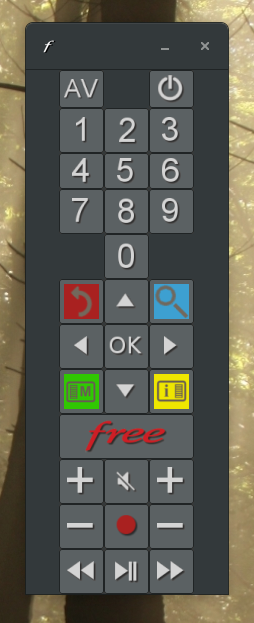

.. raw:: html

    
    

.. role:: bold_red
.. role:: done

Freemote
========

Une (autre) application télécommande pour Freebox_.

.. _Freebox: https://en.wikipedia.org/wiki/Freebox 
	   
Ecrite en  Python3_ et utilisant PyGobject_,
elle a l'intégration aux bureaux Linux (desktop_) pour
objectif.

.. _Python3: http://www.python.org

.. _PyGobject: https://pygobject.readthedocs.io/en/latest

.. _desktop: https://www.freedesktop.org/wiki

*Desktop* intégration
---------------------

* intégration au menu de bureau

  .. image:: screenshots/desktop.png

  Freemote s'est glissée dans la catégorie *Son et vidéo*.

* icône de barre de notifications

  .. image:: screenshots/status-bar-tooltip.png

  **Note**: un clic sur cette icône fait apparaître ou
  disparaître la télécommande.

* menu de barre de notifications

  .. image:: screenshots/status-icon-menu.png

  ...qui est identique au menu de l'application...

  .. image:: screenshots/application-menu.png

Les captures présentées ci-dessus résultent d'une
exécution de Freemote sur un bureau Cinnamon_, avec les
thèmes *GNome*, pour le bureau, et *Adwaita-dark* pour
les outils.

.. _Cinnamon: https://en.wikipedia.org/wiki/Cinnamon_(software)

Fonctionnalités
---------------

Dans un premier temps, la télécommande implémente l'API http
*historique* de contrôle de la Freebox, apparue sur la version 5,
toujours supportée par les boitiers *Cristal* et *Révolution*.

L'article, datant de 2010, "`Comment créer une télécommande virtuelle
pour la Freebox`_" d'UniversFreebox_ expose les bases de cette API.

.. _Comment créer une télécommande virtuelle pour la Freebox: https://www.universfreebox.com/article/10808/Comment-creer-un-telecommande-virtuelle-pour-la-Freebox

.. _UniversFreebox: https://www.universfreebox.com

Dans un soucis d'intégration à l'environnement d'un ordinateur personnel,
Freemote, en plus d'offrir les capacités de clic de souris sur les boutons
de la télécommande, offre la capacité d'interagir avec son clavier.

* l'utilisation de la touche *Control* du clavier durant un clic permet d'émettre
  un *appui long*

* le clavier permet, lui aussi, d'émettre des émissions d'appui.

  La combinaison *Ctrl+<touche>* permettant, là aussi, de produire un appui long.

  Dans ce contexte d'utilisation, la correspondance clavier-télécommande est la suivante:

  +--------------------+-----------------------+
  | Clavier            | Télécommande          |
  +====================+=======================+
  | 0-9                | 0-9                   |
  +--------------------+-----------------------+
  | Entrée/Retour      | OK                    |
  +--------------------+-----------------------+
  | <directions>       | <directions>          |
  +--------------------+-----------------------+
  | +/-                | Volume +/-            |
  +--------------------+-----------------------+
  | Page Up/Down       | Programme +/-         |
  +--------------------+-----------------------+
  | Début de ligne     | Home (Free)           |
  +--------------------+-----------------------+
  | S ou M             | Mute                  |
  +--------------------+-----------------------+
  | Point décimal      | Record                |
  +--------------------+-----------------------+
  | P/N                | Arrière/Avance        |
  +--------------------+-----------------------+
  | B/R/Y/G            | Blue/Red/Yellow/Green |
  +--------------------+-----------------------+
  | J/V                | Jaune/Vert            |
  +--------------------+-----------------------+

  **Note**: quand elle ne sont pas *capturées* par l'environnement
  de bureau, les touches *Audio* du clavier sont aussi redirigées
  vers la Freebox.
  
Installation
------------

Deux cas d'usages d'installation sont possibles:

1. installation simple utilisateur

   Les fichiers d'intégration au bureau que sont *freemote.desktop* et
   l'icône *freemote.png* doivent être accessibles dans les répertoires

   - *~/.local/share/applications*

     pour *freemote.desktop*
     
   - *~/.local/share/icons*
     
     pour *freemote.png*

   L'exécutable, *freemote*, doit être dans le *PATH*.

   Personnellement, j'adopte la politique suivante:

   a. je crée les répertoires locaux:
      ::

	 $ mkdir -p ~/.local/bin ~/.local/share/{applications,icons}
   
   b. j'installe les données de l'application dans un répertoire dédié,
      *~/.local/share/freemote-<version>*:
      ::
	 
	 $ cd ~/.local/share
	 $ tar xzf ~/Téléchargements/freemote-<version>.tgz
      
   c. je crée les liens symboliques suivants:
      ::
	 
	 $ ln -s ~/.local/share/freemote-<version>/freemote/freemote ~/.local/bin
	 $ ln -s ~/.local/share/freemote-<version>/freemote/freemote.desktop ~/.local/share/applications
	 $ ln -s ~/.local/share/freemote-<version>/freemote/resources/freemote.png ~/.local/share/icons

   d. je rajoute dans mon *PATH* le répertoire : *~/.local/bin*
      ::
	 
	 $ export PATH=${PATH}:~/.local/bin
	 
      **Note**: cette adaptation du *PATH* est depuis loooongtemps dans mon fichier *.bashrc*

2. installation globale sur le système

   La commande :
   ::

      # ./setup.py install
   
   installe ce qui est nécessaire en */usr/local/bin*, */usr/local/share/{applications,icons}*.

Dépendances
-----------

* Python3 (>= 3.6.4)

* Python3-GObject (>= 3.26.1)

  - GLib
    
  - Gio
    
  - Gdk-3.0

  - Gtk-3.0

**Note**: les versions de *Python3* et de *Python3-GObject* ne sont données qu'à titre indicatif...

...ce sont les versions qui ont servi au test de l'application et ne correspondent pas à une sélection fonctionnelle. 

Futur
-----

0. corriger les bugs

1. :done:`finaliser les scripts d'installation`
   
2. :done:`permettre l'envoi de séquences de touches en ligne commande
   pour de l'intégration domotique...`

   ...cas d'usage similaire au `plugin Fibaro suivant`_.

   .. _plugin Fibaro suivant: https://www.domotique-fibaro.fr/topic/1984-plugin-freebox-player-remote/
   
3. implémenter le support du *nouveau* protocole HID/rudp de la Freebox
   révolution décrit dans le `SDK Freebox`_...

   ...probablement en utilisant le framework de `MaximeCheramy/remotefreebox`_.

   .. _SDK Freebox: https://dev.freebox.fr/sdk/
   .. _MaximeCheramy/remotefreebox: https://github.com/MaximeCheramy/remotefreebox

4. exploiter le nouveau protocole pour rediriger Clavier et Souris du
   PC vers le contrôle de la box...

   ...par grab des devices.
   
